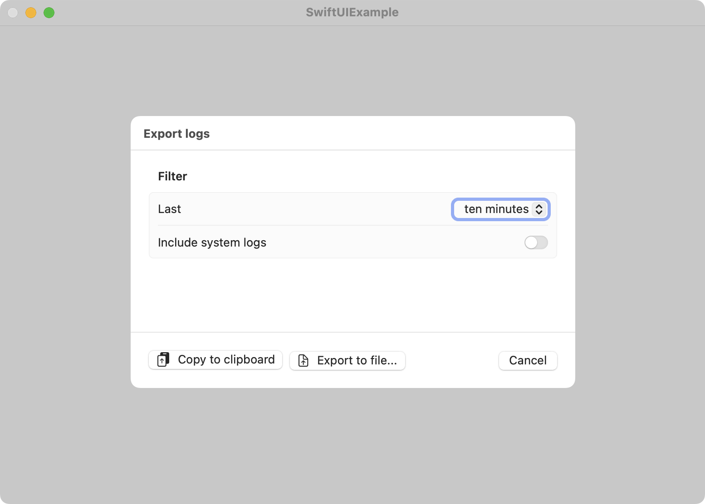
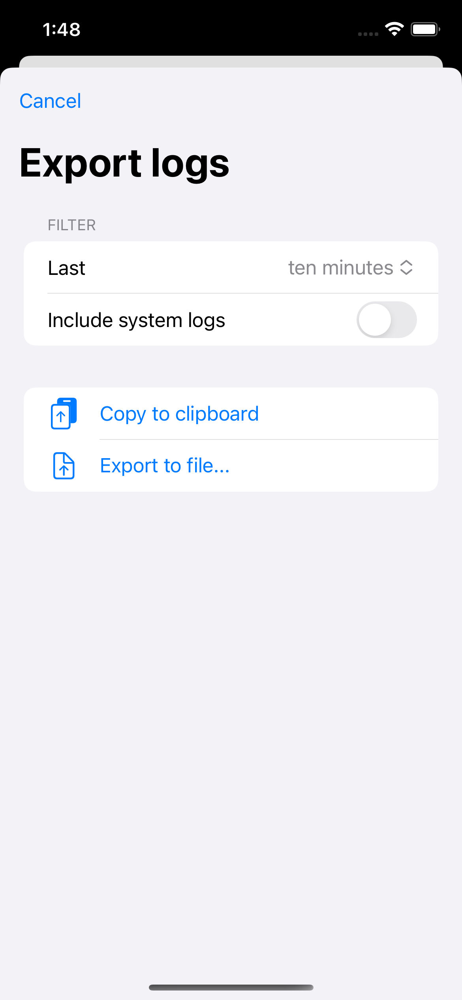

# LogExport

This Swift package aids in debugging your applications by enabling users to 
export logs and send them to you. Add a button to your application using 
this Swift package to facilitate this process.

### macOS (SwiftUI)



### iOS (SwiftUI)



## Usage

### Installation

To add this package as a dependency to your Xcode project, use the following 
package URL:`https://github.com/loshadki/LogExport-package`.

Then you only need to import `LogExport` into your SwiftUI view:

```swift
import LogExport
``` 

And add the following button:

```swift
LogExportButton()
```

### Writing logs

Logs written with the subsystem `Bundle.main.bundleIdentifier!` will be included 
as application logs in the default export, while all other logs will be classified 
as system logs.

You can define your loggers as follows:

```swift
private static var log: Logger = Logger(subsystem: Bundle.main.bundleIdentifier!, category: String(describing: MyClass.self))
```

To use the logger, you have to import the system package `OSLog`:

```swift
import OSLog
```

To write the logs, you can use:

```swift
Self.log.info("some user action")
```

For more information, read the [Logger](https://developer.apple.com/documentation/os/logging) documentation.

### Privacy Considerations

It's important to ensure you don't export users' private information. 
Hash sensitive data for protection. Any type of data that includes user names 
can be sensitive, such as folder names, object names, descriptions, file paths, etc. 
Use a hash to mask these data, allowing you to recognize the same data without 
knowing the exact value. For example:

```swift
Self.log.info("user saved file \(fileName, , privacy: .sensitive(mask: .hash))")
```

At the same time, you can log non-user specific data with `.public` privacy flag:

```swift
Self.log.info("user selected action \(action, privacy: .public)")
```

## License

This project is licensed under the [MIT License](./LICENSE)